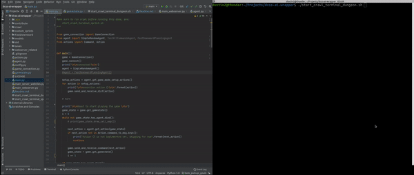
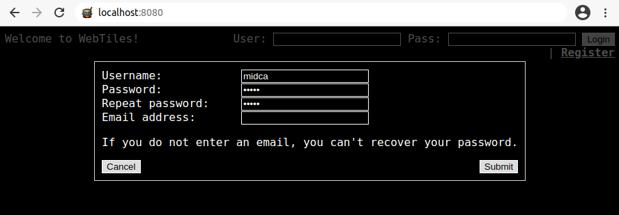
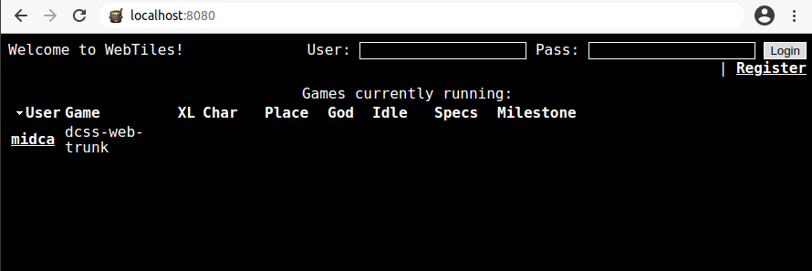

# AI Wrapper for Dungeon Crawl Stone Soup

(Demo of an agent taking random actions to play DCSS in the browser using the docker container running a DCSS webserver instance)

(Demo of an agent taking random actions to play DCSS in the terminal)

# About

**dcss-ai-wrapper** is an API for Dungeon Crawl Stone Soup for Artificial Intelligence research. This effort started with the following paper: 

*Dannenhauer, D., Floyd, M., Decker, J., Aha D. W. [Dungeon Crawl Stone Soup as an Evaluation Domain for Artificial Intelligence.](https://arxiv.org/pdf/1902.01769) Workshop on Games and Simulations for Artificial Intelligence. Thirty-Third AAAI Conference on Artificial Intelligence. Honolulu, Hawaii, USA. 2019.*

If you use this repository in your research, please cite the above paper.

If you'd like to contribute to the research effort aligned with this project, see [Research Effort](contribute/ResearchEffort.md) and [Roadmap](contribute/Roadmap.md)

# Development Community

Join the chat at https://gitter.im/dcss-ai-wrapper/community

Checkout the YouTube channel for live coding streams and tutorial videos (more content to come soon): https://www.youtube.com/channel/UCPR_UzIThpHNGEZos1SVmLQ 

# Quickstart

Clone this repository

    git clone https://github.com/dtdannen/dcss-ai-wrapper.git    

Create a virtualenv and install packages

    python3 -m venv .env

On Linux in the shell:

    source .env/bin/activate

Or on Windows from powershell:

    ./Scripts/Activate.ps1

Then to install all packages into this virtualenv:

    pip install -r requirements.txt

Pull a pre-made docker image with the DCSS webserver installed (if you'd like to create your own docker or install DCSS yourself, see instructions below):

    
    docker pull dtdannen34/dcss-ai-wrapper

Run the docker and open an interactive shell

    docker run -it -p 8080:8080 b3d5cdf181b8

Now launch the webserver from within the docker interactive shell by first activate python:

    cd /dcss/crawl/crawl-ref/source/webserver
    source venv/bin/activate

Then run the webserver:

    cd ..
    python webserver/server.py
    

Now you can leave the docker alone, as long as it keeps running agents can connect and play the game.

Open your browser to http://localhost:8080/ to the DCSS browser interface, which should look like:

Click on the 'Register' button and create an account with the following values:

* Username: midca
* Password: midca
* Repeat password: midca
* *Leave the Email Address field blank*

Then click 'Submit'.

By default you'll be logged in on the browser but it's recommended for you to be logged out so go ahead and click the 'Logout' button.

**Note:** Do not login on the browser yourself, creating the account is so that the agent in the API can connect and play. You will spectate the agent without logging in yourself.

Now you can run your agent by running main_webserver.py:

    python main_webserver.py

Within 1-2 seconds you should see the agent show up in the lobby of the web browser, something like this:

Wait for the agent to get past the character creation menus (there's a strange bug that appears if you spectate too early - this should only take a few seconds), then click on the agent's name, which in this case is 'midca'. You will now be spectating the agent, for example:

Now you're all set to go with the SimpleRandomAgent being able to play the game! The rest of this README file contains additional details on using the DCSS AI Wrapper.

Recommended next step: install FastDownward planner to run the FastDownwardPlanningAgent. 

# Install and run the fastdownward planner 

1. Download and compile the [fastdownward planner](http://www.fast-downward.org/ObtainingAndRunningFastDownward) and put it in a folder under dcss-ai-wrapper so the folder structure looks like this:

    `dcss-ai-wrapper/FastDownward/fast-downward.py`

2. Switch the agent in config.py `AIConfig.ai_python_class` to be the `FastDownwardPlanningAgent` agent, like:

    `ai_python_class = 'FastDownwardPlanningAgent'`

3. Run main_webserver.py and it should work. There's a chance that the fastdownward planner will fail to find a plan because of a missing feature of our api. Since the dungeon is procedurally generated, try a few times before troubleshooting fastdownward. If you do need to troubleshoot, start by displaying fastdownward's output. This can be done by removing the `stdout=subprocess.DEVNULL` option when calling FastDownward via subprocess in the FastDownwardPlanningAgent class.

# Installing DCSS from Source on Ubuntu

### Pre-requisites

This guide has been tested on Ubuntu 18.04 LTS and assumes you have the following installed:

- git | `sudo apt-get install git`
- python2 | `sudo apt-get install python2.7`
- pip2  | `sudo apt-get install python-pip`
- python3 | `sudo apt-get install python3.6`
- pip3 | `sudo apt-get install python3-pip`
- A variety of packages required by Dungeon Crawl Stone Soup

    `sudo apt-get install build-essential libncursesw5-dev bison flex liblua5.1-0-dev libsqlite3-dev libz-dev pkg-config python-yaml libsdl2-image-dev libsdl2-mixer-dev libsdl2-dev libfreetype6-dev libpng-dev ttf-dejavu-core`

### Installing Dungeon Crawl Stone Soup

While this API is likely to work with the current dcss master branch, it has been tested with the 23.1 version, which
is the recommended version of crawl to use with this API. We recommend installing a local version of crawl inside this
project's folder.

1. Make sure you have cloned this repository (dcss-ai-wrapper)
    
2. Grab a copy of the 23.1 version of crawl, by cloning the repo and then resetting to the 23.1 version

   `cd ~/dcss-ai-wrapper/`  (assuming this is the directory where you cloned this project - dcss-ai-wrapper)
   
   `git clone https://github.com/crawl/crawl.git`
   
   `cd ~/dcss-ai-wrapper/crawl/`
   
   `git reset --hard d6e21ad81dcba7f7f8c15336e0e985f070ce85fb`
   
   `git submodule update --init`

3. Compile crawl with the following flags

    `cd ~/dcss-ai-wrapper/crawl/crawl-ref/source/`
    
    `sudo make install prefix=/usr/local/ WEBTILES=y`

    __Note for installing on Ubuntu 20.04:__
    
    If you get an error saying "/usr/bin/env cannot find python", then one possible fix is to the do the following (but beware this may change the default python on your system)

    `sudo ln --symbolic /usr/bin/python2.7 /usr/bin/python`

    Note that Python2.7 is needed to compile crawl.
    
4. Check that the `crawl/crawl-ref/source/rcs' folder exists, if not create it:

    `mkdir crawl/crawl-ref/source/rcs`

# How to Run a simple agent in the terminal

1. Open a new terminal, cd into dcss-ai-wrapper/ and run:

    First time running the following script may require: `chmod +x start_crawl_terminal_dungeon.sh`

    `./start_crawl_terminal_dungeon.sh`

   Note that nothing will happen until an agent connects.
   
   The terminal that runs this command must be a minimum width and height, so try enlarging the terminal if it doesn't work and you are using a small monitor/screen. (Only try changing the width if the next step fails).

2. Open a new terminal, cd into dcss-ai-wrapper/ and run:

    `python3 main.py`
	    
3. You should now be able to watch the agent in the terminal as this script is running, as shown in the demo gif at the top of this readme.

## Web browser via Docker Image

The docker image is the quickest way to get a server up and running so that you can watch the agent play by spectating the game in the browser.

After installing docker, do the following:

    docker pull dtdannen34/dcss-ai-wrapper
    
Then run the docker in interactive mode:

    docker run -it -p 8080:8080 b3d5cdf181b8
    
Now you should be in the command line of the docker container, and you need to run the webserver.

First activate python:

    cd /dcss/crawl/crawl-ref/source/webserver
    source venv/bin/activate

Then run the webserver:

    cd ..
    python webserver/server.py

And now you should be able to open up a browser (I recommend chrome because firefox sometimes as issues with hotkeys that prevent you from interacting with crawl)

    http://localhost:8080/
    
Then you need to register two accounts, one for the agent to connect to and another one for you to use for spectating. This is done via the web interface, click the register button and enter a username and password. It's recommend to use *midca* for the username and password for one of the accounts - these are the current default values used in the script that connects the AI to the webserver. You can choose any other username and password you want for the other user. You don't need to fill in the email field. Note that every time you start up the webserver you'll have to re-do this registration step because it's not saved between docker runs.

The next step is to run the `main_webserver.py` script. After a second, you should see the name *midca* pop up in the browser. If you click on it you should be able to watch the agent play. It's best to watch the agent from the browser that is signed into with the non-midca account (the one for spectating). 

### Older Instructions for manually setting up webserver

There is no guarantee that these instructions are still valid - proceed at your own risk :)

The following steps enable the API to connect to DCSS running on a webserver on the local host, which means you can watch
your AI agent play DCSS in the tile version that runs in the web browser.

1. Install requirements to run the webserver version of the game

    `sudo pip2 install tornado==3.0.2`
    
    `sudo pip3 install asyncio`
    
    `sudo pip3 install websockets`

2. Test that the browser version of the game is working

    `cd ~/dcss-ai-wrapper/crawl/crawl-ref/source/`
    
    `python2 webserver/server.py` 

     Now open your web browser and go to http://localhost:8080/

     Click register at the top right (not necessary to enter an email).

     Then after logging in, click the leftmost link under "Play now:" which is "DCSS trunk".
     You should then go to a menu where you choose your character configuration (i.e. species > background > weapon)
     Once you proceed through the menus you should find yourself in a newly generated world. If you've reached this
     step (and can see the tiles) you have successfully installed the game.

# Troubleshooting

  Problem: Errors during compiling
  Solution: Double check you installed all the packages listed at the
  beginning that crawl needs. These come from the install instructions
  for crawl itself.

  Problem: No images showing up and getting errors from the webserver like:
    'HTTPOutputError: Tried to write X number of bytes but error with content length'
    
  Solution: Make sure you are using tornado 3.0 (which may not be the version that installs by default)

# Running the webserver
----------

Note these instructions may be outdated.

## Start webserver

   `cd crawl_18/crawl/crawl-ref/source/`
   `python2 webserver/server.py`

## now check to see if its up using a browser at localhost:8080

### If this is the first time you are running this on your machine,
  you will need to register an account on the webserver (in the
  browser). Keep track of the username and password, as you will enter
  this into the code file, which the agent will use to connect to the
  server.

## In a new terminal, go back to top level dir 

## run the test_interface script using python3 (sidenote: installing asyncio
  on python2.x will initially work but then you get errors when trying
  to import it)

    `python3 main.py`

# Watching the Agent Play

1. Navigate your browser to localhost:8080

2. You should see a list of agents playing, click on the agent's name to spectate (note, you do not need to log in for this). If you don't see the agent on the list, try refreshing the page.

