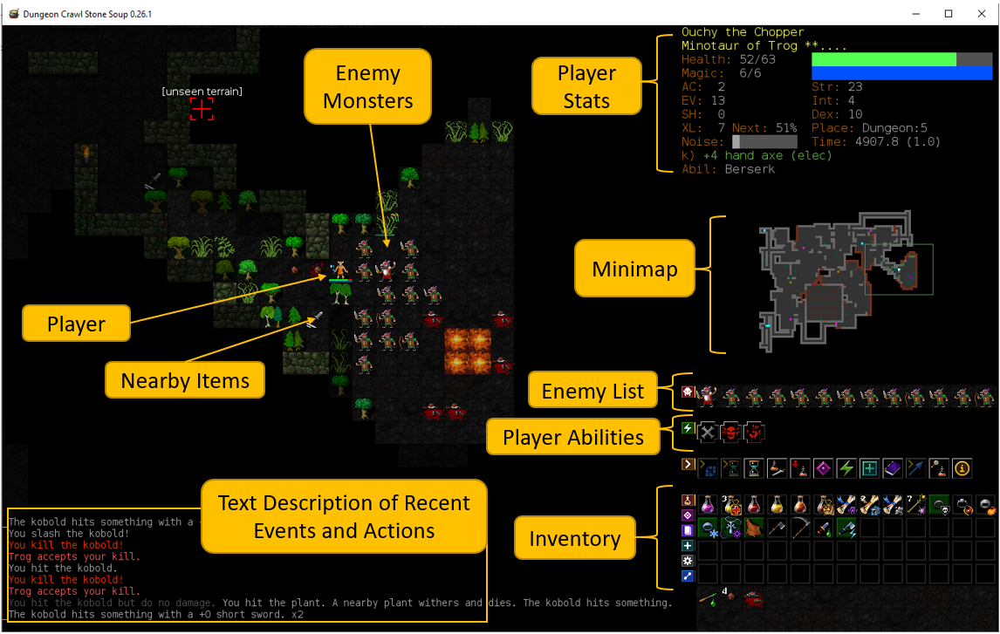

*******************
ACS 2022 Tutorial
*******************

.. note:: We will be adding more content to this page between now and the tutorial start. We welcome any and all questions to be asked via the Gitter public chatroom for the dcss-ai-wrapper project here: `https://gitter.im/dcss-ai-wrapper/community <https://gitter.im/dcss-ai-wrapper/community>`_

    Updates:

    * **[October 20th]** First draft of this tutorial is posted online.
    * **[November 20th]** The tutorial will be held online using Zoom, more details to follow. See the conference slack channel  # tutorial_2022
    * **[November 20th]** We will use the **main ACS conference Zoom** link
    * **[November 20th]** The in-person session will be in Multipurpose room 125

Introduction
============
**dcss-ai-wrapper** aims to enable the Dungeon Crawl Stone Soup (DCSS) video game to be used as an evaluation domain
for AI research. While more traditional planning benchmarks exist (i.e. IPC domains) and more traditional RL
benchmarks exist (i.e. open-ai gym), it is often difficult to compare an RL agent on IPC domains or a planner
on RL domains. DCSS-AI-Wrapper aims to provide support for both automated planning and RL in the DCSS video game.

    Annotated Screenshot of Dungeon Crawl Stone Soup's Interface

`Dungeon Crawl Stone Soup <https://crawl.develz.org/>`_ (`Github <https://github.com/crawl/crawl>`_) is a single-player, free, and open-source rogue-like turn-based video game that consists
of a procedurally generated 2-dimensional grid world. To win the game, a player must navigate their character
through a series of levels to collect `The Orb of Zot' and then return to the starting location. Along the way,
the player encounters a wide variety of monsters and items. Players equip and use items to make themselves stronger
or consume them to aid in difficult situations. The DCSS environment is dynamic, stochastic, partially observable,
and complex with the number of instantiated actions the player may take reaching into the hundreds.

**dcss-ai-wrapper** is the first AI-friendly API designed to enable planning-based agents to play Dungeon Crawl Stone Soup.
In this tutorial we will introduce the DCSS game, explain the rationale and design of the API, and guide participants through
exercises to run agents in DCSS. No experience with DCSS is necessary. For the hands-on portions, basic python programming
experience will be useful. By the end of the tutorial you will have an automated planning agent playing DCSS on your machine
using the FastDownward planner.

Schedule
========
The main objective of this tutorial is to provide a hands-on tutorial of the software. By the end of the tutorial,
the attendees will be able to install the game / API wrapper, understand various API functionalities,
be able to run sample Automated Planning agents, and understand the experimental metrics that can be used.
We plan for a 4 hour tutorial.

**Date:** Tuesday, November 22nd, 2022

**Time (UTC-4, aka EST):** TBD

**Time (UTC+8):** TBD

**Location:** We hope to hold the tutorial as a hybrid event, both in person at the Advances in Cognitive Systems conference
and virtually through **<online platform TBD>**.

After the tutorial ends, you are more than welcome to continue the conversation and ask questions in the gitter chatroom
for this project: `https://gitter.im/dcss-ai-wrapper/community <https://gitter.im/dcss-ai-wrapper/community>`_

**Tentative** Schedule:

+---------------+-----------------------------------------------------------------------+
|   Time        | Description                                                           |
+===============+=======================================================================+
| 8:45am - 9am  | Setup and helping attendee’s with any installation issues             |
+---------------+-----------------------------------------------------------------------+
| 9am - 9:30am  |  Introduction to the DCSS Game                                        |
+---------------+-----------------------------------------------------------------------+
| 9:30am - 10am |  DCSS-AI-Wrapper API - Rationale, current status & how you can help   |
+---------------+-----------------------------------------------------------------------+
| 10am to Noon  | Excercises (organizer will be available to help guide participants    |
|               | through these excercises):                                            |
|               |                                                                       |
|               | * Exercise 1: Get random agent running and watch it play in the       |
|               |   browser                                                             |
|               | * Exercise 2: Get fastdownward agent running and watch it play in the |
|               |   browser                                                             |
|               | * Exercise 3: Make a custom level                                     |
|               | * Exercise 4: See how far down the dungeon you can go, by modifying   |
|               |   the planning agent                                                  |
+---------------+-----------------------------------------------------------------------+

Preparing for the Tutorial
==========================

Please perform the following steps to get your system ready for the live tutorial session. This includes installing
**dcss-ai-wrapper** and the **FastDownward** planner on your system.

**(optional, fun)** Try playing `Dungeon Crawl Stone Soup <https://crawl.develz.org/>`_ yourself to get a feel for the game. See how far in the dungeon you can go!

Software prequisites:

* `Git <https://git-scm.com/book/en/v2/Getting-Started-Installing-Git>`_
* `Python 3.8 or higher <https://www.python.org/downloads/>`_
* `Docker <https://docs.docker.com/get-docker/>`_

**Next** install dcss-ai-wrapper by following these instructions here: :ref:`quickstart`

**Finally** install FastDownward by following their instructions here: `http://www.fast-downward.org/ObtainingAndRunningFastDownward <http://www.fast-downward.org/ObtainingAndRunningFastDownward>`_

    * Rename the fastdownward folder to be 'FastDownward' and make sure it's in the top level dcss-ai-wrapper directory, like::

        dcss-ai-wrapper/FastDownward/

    * You will need to be able to call `fast-downward.py` from the command line (on Windows via powershell, or in Unix based systems on the command line) so the best
      instructions to follow are the ones where you compile it. We have not tested using FastDownward from the Vagrant
      or Docker installation images.

    * If you have trouble installing FastDownward, you can still follow along with the tutorial up to a certain point,
      and run agents that don't use FastDownward.

The ultimate test to see if everything is installed and working correctly is to run the `fastdownwardplanningagent.py` agent in `src/dcss/agent/fastdownwardplanningagent.py` like:

.. code-block:: console

    cd dcss-ai-wrapper/  # make sure you're in the project root and the virtual env is active
    python .\src\dcss\agent\fastdownwardplanningagent.py

Then go to the browser and if you can see the agent moving around then it means it's working. It should be exploring new
tiles and attacking monsters whenever it finds them (albeit sometimes poorly).
