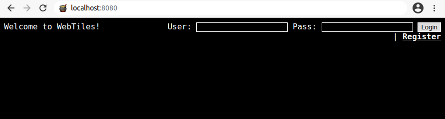
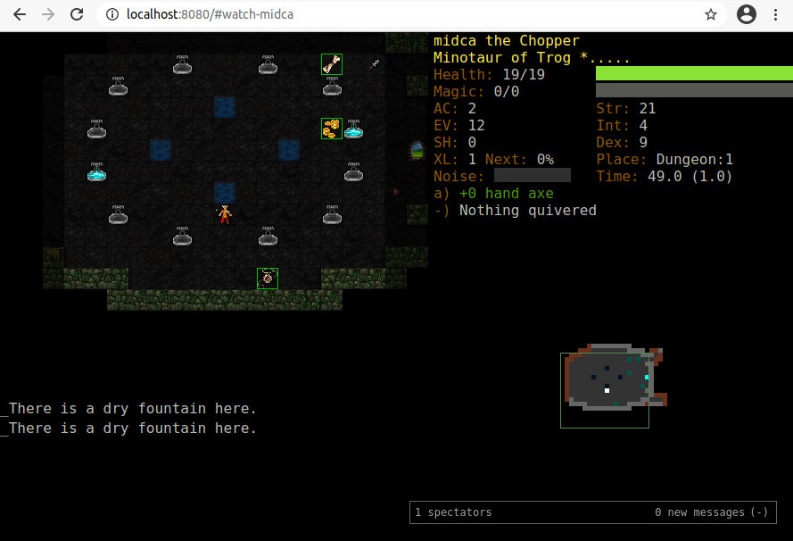

.. _quickstart:

**********
Quickstart
**********

Clone the repository::

    git clone https://github.com/dtdannen/dcss-ai-wrapper.git

Change directory to the new dcss-ai-wrapper folder::

    cd dcss-ai-wrapper/

Create a virtualenv and install packages::

    python3 -m venv .env

On Linux in the shell::

    source .env/bin/activate

Or on Windows from powershell::

    ./.env/Scripts/Activate.ps1

Then to install all packages into this virtualenv::

    pip install -r requirements.txt

And do a pip install of the project in develop mode so you can change files in between running agents::

    pip install -e .

**Using Docker to run the Webserver**

There are two ways to run the webserver via docker: use a premade image (option 1) or build the webserver docker yourself (option 2).

**(Option 1) Build the docker image yourself**::

    cd docker_webserver/
    docker build .

It will take a few minutes to compile. Once it finishes, run::

    docker images

to find the newly created image, and copy the **IMAGE ID** value. Then launch the docker::

    docker run -p 8080:8080 <paste image_id here>

**(Option 2) Use a pre-made Docker image**

Pull a pre-made docker image with the DCSS webserver installed (if you'd like to create your own docker or install DCSS yourself, see :ref:`installation`)::

    docker pull dtdannen34/dcss-ai-wrapper:webtilesserver

Run the docker and open an interactive shell::

    docker run -it -p 8080:8080 b3d5cdf181b8

Now launch the webserver from within the docker interactive shell by first activating python environment and then running the webserver::

    cd /dcss/crawl/crawl-ref/source/webserver
    source venv/bin/activate

Then run the webserver::

    cd ..
    python webserver/server.py

**Register the agent on the docker webserver via the browser**

Now you can leave the docker alone, as long as it keeps running, agents can connect and play the game.

Open your browser to http://localhost:8080/ to the DCSS browser interface, which should look like:

Click on the 'Register' button and create an account with the following values:

* Username: midca
* Password: midca
* Repeat password: midca
* *Leave the Email Address field blank*

.. image:: ../_static/dcss_browser_screenshot_2.png

Then click 'Submit'.

By default you'll be logged in on the browser but it's recommended for you to be logged out so go ahead and click the 'Logout' button.

**Note:** Do not login on the browser yourself, creating the account is so that the agent in the API can connect and play. You will spectate the agent without logging in yourself.

**Open a new terminal, navigate to dcss-ai-wrapper, activate the virtual environment, and try running an agent**::

    cd dcss-ai-wrapper/

On Linux in the shell::

    source .env/bin/activate

Or on Windows from powershell::

    ./.env/Scripts/Activate.ps1

Now you can run the random agent by running the following from the project root: dcss-ai-wrapper/ ::

    python .\src\dcss\agent\randomagent.py

Within 1-2 seconds you should see the agent show up in the lobby of the web browser, something like this:

.. image:: ../_static/dcss_browser_screenshot_3.png

Wait for the agent to get past the character creation menus (there's a strange bug that appears if you spectate too early - this should only take a few seconds), then click on the agent's name, which in this case is 'midca'. You will now be spectating the agent, for example:

Now you're all set to go with the SimpleRandomAgent being able to play the game! The rest of this README file contains additional details on using the DCSS AI Wrapper.

